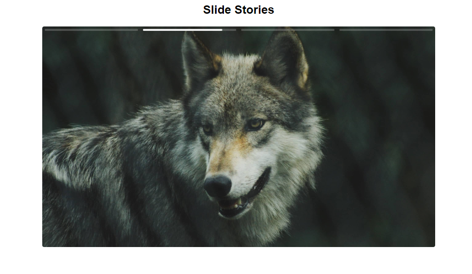

Stories do instagram feito com Typescript


Adicione ao seu site o arquivo script.js que está dentro da pasta dist.

```html
<body>
  <h1>Slide Stories</h1>
  <div id="slide">
    <div id="slide-elements">
      
      
      
      <video playsinline src="./assets/video.mp4"></video>
    </div>
    <div id="slide-controls"></div>
  </div>
  <script type="module" src="./dist/script.js"></script>
</body>
```

```js
// código para o arquivo /dist/script.js
// O primeiro seletor .slide, deve ser o elemento que envolve diretamente a div que envolve os elementos.
// O segundo seletor deve ser os elementos que você quer que seja o slide.
// O terceiro elemento deve ser uma div vazia que será os controles.
// O quarto elemento será o tempo em ms para o slider passar.
if (container && elements && controls && elements.children.length) {
    const slide = new Slide(container, Array.from(elements.children), controls, 3000);
}
```


